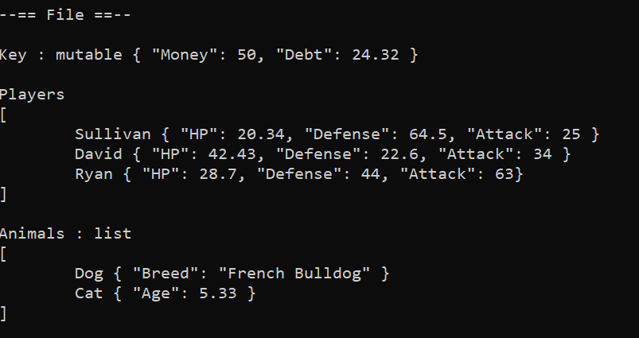
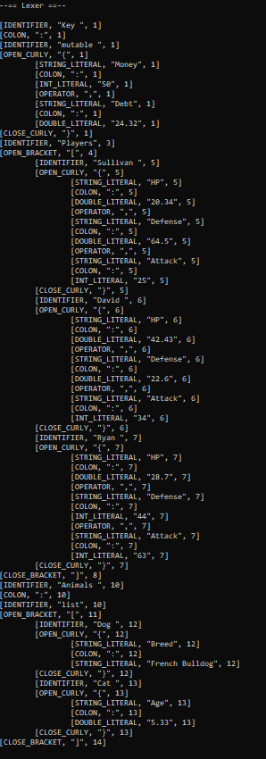

# Coral

Coral, a parser for my json-like language!

## How to run

If you download the source code, and run Main.cpp, you can run the program as normal.
You can also download the latest stable source code release from the releases page, and get information on it too.

## How to use

As prompted, enter the path to the coral file you want to parse.

## Syntax

How items are defined:

```
Jeffery { "HP": 80.67, "Durability": 20 }
```

how arrays are defined; arrays are different to lists because they are always `Immutable`:

```
Players
[
  Jeffery { "HP": 80.67, "Durability": 20 } # This will be immutable.
  Donnald { "HP": 76, "Durability": 40.57 } # This will also be immutabe.
]
```

how lists are defined; lists are different to arrays because they are always `Mutable`:

```
Animals : list
[
	Dog { "Breed": "French Bulldog" } # This will be mutable.
	Cat { "Age": 5.33 }               # This will also be mutable.
]
```

By default, objects are `Immutable`, or unchange-able (Also, comments are defined with a `#` symbol):

```
Kay { "Money": 50, "Debt": 23 } # This will be outputed as Immutable.
```

By adding the `mutable`, or the `!mutable` keyword after an identifier, you can express it's mutability:

```
Kay : mutable { "Money": 50, "Debt": 23 }
```

or

```
kay : !mutable { "Money": 50, "Debt": 23 }
```

## Examples

### (Original Code)


### (Output)

#### (Lexer)


#### (Parser)

