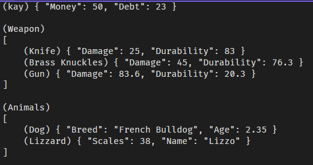
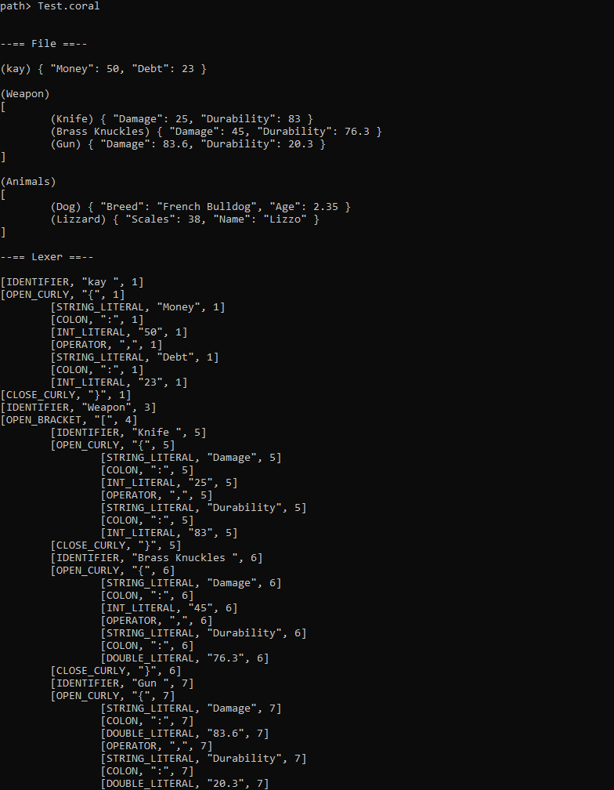
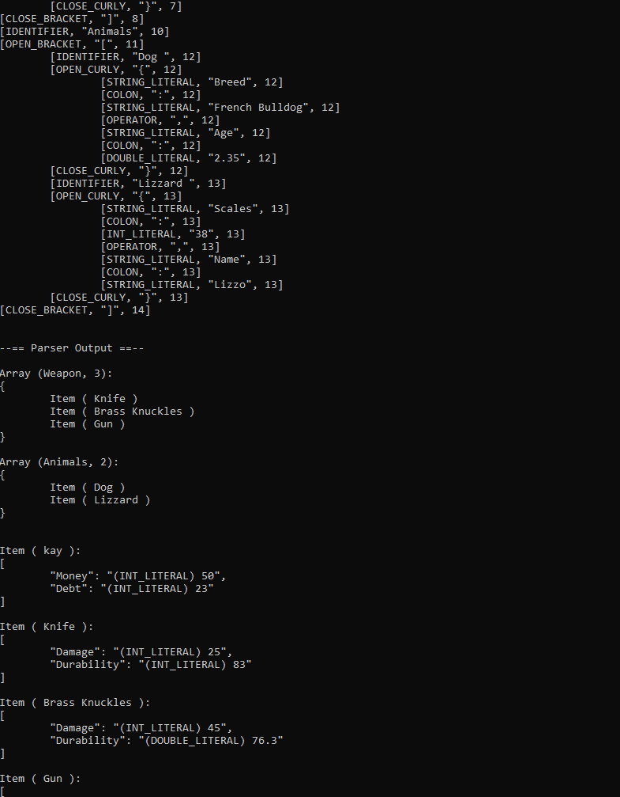
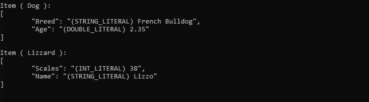

# Coral

Coral, a parser for my json-like language!

## How to run

If you download the source code, and run Main.cpp, you can run the program as normal.
Otherwise, you can download the exe from the releases page.

## How to use

As prompted, enter the path to the coral file you want to parse.

## Syntax

How items are defined:

```
(Jeffery) { "HP": 80.67, "Durability": 20 }
```

how arrays are defined:

```
(Players)
[
  (Jeffery) { "HP": 80.67, "Durability": 20 }
  (Donnald) { "HP": 76, "Durability": 40.57 }
]
```

## Examples

### (Original Code)


### (Output)



