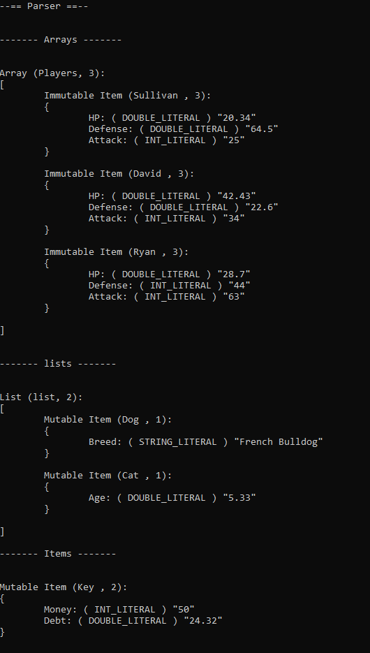

# Coral

Coral, a parser for my json-like language!

## How to run

If you download the source code, and run Main.cpp, you can run the program as normal.
Otherwise, you can download the exe from the releases page.

## How to use

As prompted, enter the path to the coral file you want to parse.

## Syntax

How items are defined:

```
Jeffery { "HP": 80.67, "Durability": 20 }
```

how arrays are defined:

```
Players
[
  Jeffery { "HP": 80.67, "Durability": 20 }
  Donnald { "HP": 76, "Durability": 40.57 }
]
```

By default, objects are `Immutable`, or unchange-able (Also, comments are defined with a `#` symbol):

```
Kay { "Money": 50, "Debt": 23 } # This will be outputed as Immutable.
```

By adding the `mutable`, or the `!mutable` keyword after an identifier, you can express it's mutability:

```
Kay : mutable { "Money": 50, "Debt": 23 }
```

or

```
kay : !mutable { "Money": 50, "Debt": 23 }
```

## Examples

### (Original Code)


### (Output)

#### (Lexer)


#### (Parser)

